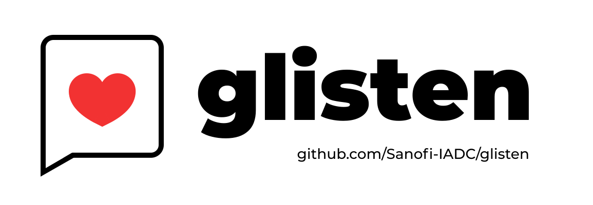
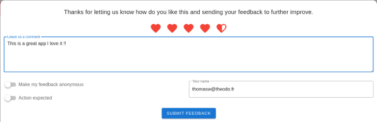
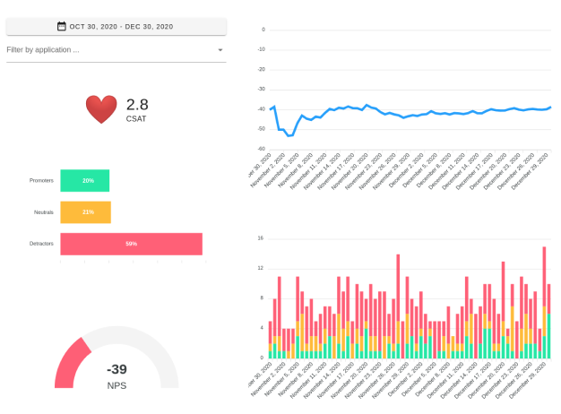

[](https://www.npmjs.com/package/@sanofi-iadc/glisten)

Glisten is a Vue component library that helps managing feedbacks in a Vue application. It is composed of 2 components, a **client component** that provides a modal and the logic to push a feedback, and a **dashboard component** to manage and monitor these feedbacks.

It relies on [Whispr](https://github.com/Sanofi-IADC/whispr) as a backend.

<p align="center">
  
</p>

<p align="center">
  
</p>

# Documentation

To check out docs, visit https://sanofi-iadc.github.io/glisten/.

# Installation

Install the component in your project.

```sh
npm install @sanofi-iadc/glisten
```

You need to install [Vuetify](https://github.com/vuetifyjs/vuetify) and [Vue-apollo](https://github.com/vuejs/vue-apollo) to use theses compoents

```sh
npm install vuetify vue-apollo
```

Then configure vue-apollo to connect your project to [Whispr](https://github.com/Sanofi-IADC/whispr)

```javascript
import Vue from 'vue';
import VueApollo from 'vue-apollo';
import Glisten, { GlistenClient, GlistenDashboard, ApolloProvider } from '@sanofi-iadc/glisten';

Vue.component('GlistenClient', GlistenClient); // this is not mandatory if you need to use only one component
Vue.component('GlistenDashboard', GlistenDashboard);

Vue.use(Glisten);
Vue.use(VueApollo);
Vue.use(Vuetify);

new Vue({
  vuetify,
  apolloProvider: ApolloProvider(
    process.env.VUE_APP_WHISPR_API_HTTP_URL,
    process.env.VUE_APP_WHISPR_API_WS_URL, // this is not needed if you use only GlistenClient
    authToken, // this is not needed if you use only GlistenClient
  ),
  render: (h) => h(App),
}).$mount('#app');
```

You can then use these components anywhere in your project (See usage below)

## Installation in Nuxt project

**Right now SSR doesn't not work with Glisten !**

In a nuxt project you need to install Nuxt modules for Vuetify and Apollo, and setup it within nuxt config as such

```sh
npm install @nuxtjs/apollo
npm install @nuxtjs/vuetify
```

Add a plugin in _plugins/glisten.client.js_ :

```javascript
// glisten.client.js
import Vue from 'vue';
import Glisten, { GlistenClient, GlistenDashboard } from '@sanofi-iadc/glisten';

Vue.component('GlistenClient', GlistenClient);
Vue.component('GlistenDashboard', GlistenDashboard);
Vue.use(Glisten);
```

Then, in _nuxt.config.js_ add :

```javascript
  ssr: false, // TODO: does not work in SSR yet
  // ...

  buildModules: [
    // ...
    // https://go.nuxtjs.dev/vuetify
    '@nuxtjs/vuetify',
  ],


  modules: [
    // ...
    '@nuxtjs/apollo',
  ],

  plugins: [{ src: '@/plugins/glisten.client.js', mode: 'client' }],

  apollo: {
    clientConfigs: {
      whispr: {
        httpEndpoint:
          process.env.WHISPR_HTTP_BASE_URL, // e.g http://localhost:3000/graphql
        wsEndpoint:
          process.env.WHISPR_WS_BASE_URL, // e.g ws://localhost:3000/graphql
      },
    },
  },
```

# Usage

### Client Component

You can either use the client to add a modal on a page like this

```html
<template>
  <glisten-client
    :sheet="sheet"
    application-id="you-application-Name"
    user-name="your username"
    :custom-tracker="customTracker"
    text-field-label='Speak your mind'
    greetings="We're always looking to improve. Please share your feedback with us!"
    heart-color="#df323b"
    @close="toggleFeedback"
  />
</template>
```

**Props**

- _sheet_ (`boolean`) : modal is showed whenever true
- _application-id_ (`string`) : identify the feedback's application
- _user-name_ (`string`) : default username
- _text-field-label_=(`string`) : text displayed in the text field before the user enters something)
- _greetings_=(`string`) : greeting text displayed in the top of the component)
- _heart-color_=(`string`) : color of the heart symbols)
- _custom-tracker_ (`object`) : tracks context of the feedback (like current page URL)

```json
// for instance
{
  "contextPortal": window.location.href,
  "contextPage": "",
  "categories": ['First category, 'Second category']
}
```

**Events**

- _close_ (`void`) : emitted whenever close button is pressed

### Dashboard component

Insert on page the following comonent

```html
<template>
  <glisten-dashboard />
</template>
```

**Props**

- _admin-access-rights_ (`boolean`) : Allows you to remove feedback from the actions column of the FeedbackList component

# Roadmap

- [ ] Split installation of glisten in two npm packages separating feedback and dashboard
- [ ] Make the dashboard components exported as separate widgets so dashboards are composable and more flexible
